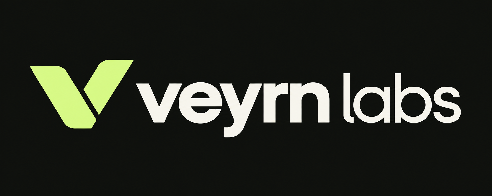

# Veyrn Labs logo direction

A split geometric V pairs forward motion with a verification gesture. The heavier veyrn wordmark establishes the brand; the lighter labs adds contrast. Lime and warm ivory connect the identity to the current site.

Generated with the built-in image generation tool. This is a raster design master on a dark background. The header and footer use the approved image through a shared Logo component, with responsive framing and Next.js image optimization. The original image is preserved. The split-V symbol also has a simplified vector favicon source at public/brand/veyrn-mark.svg; scripts/generate-brand-icons.mjs creates the browser and Apple icon sizes from it.

## Initial prompt

Use case: logo-brand.
Design one exceptional, original logo for "veyrn labs", an independent AI engineering and custom business software studio. This is a finished logo master, not a moodboard or mockup.
Exact wordmark text: "veyrn labs" (v-e-y-r-n, space, l-a-b-s), all lowercase.
Create a distinctive compact abstract V symbol made from two or three confident, precisely aligned geometric strokes with a purposeful negative-space cut. The symbol should subtly combine a V, a verification gesture, and forward progression, but avoid a stock checkmark or generic chevron. Aim for an ownable silhouette, balanced optical weight, exceptionally simple construction that remains clear at favicon size. Restrained Swiss identity design with contemporary engineering precision.
Horizontal lockup: symbol at left, wordmark at right, careful optical spacing. Wordmark uses a beautifully crafted medium-weight neo-grotesk sans serif with subtly customized letterforms, spacious but cohesive. "veyrn" is visually primary and "labs" a slightly quieter continuation on the same baseline. No slogan, no punctuation, no extra text.
Color palette: symbol in vivid soft lime #D5F688; wordmark in warm ivory #F1F0E9. Both must be opaque solid fills. Truly transparent background with alpha, no checkerboard drawn into the image. High-resolution crisp flat edges, vector-friendly shapes, generous clearspace around the complete lockup. The entire mark should be large within a wide landscape canvas, occupying roughly 80% of the width. No gradients, shadows, bevels, 3D, textures, glow, orbit rings, circuit patterns, brains, robots, sparkles, decorative lines, presentation labels, or other logos. One consistent finished horizontal logo only.

## Refinement prompt

Use case: precise-object-edit, logo-brand. Refine this Veyrn Labs logo into a pristine professional master presentation. Preserve the exact V symbol geometry, horizontal composition, exact spelling "veyrn labs", lime symbol, ivory wordmark, and font weight difference between veyrn and labs. Replace transparency with one absolutely uniform solid graphite background #10120F. Correct all edge defects and remove ALL speckles, white or lime debris, fringes, texture, ghosting and stray marks around and between letters. Rebuild contours with smooth flawless flat vector-style boundaries, with clean open counters. Lime is flat #D5F688 and ivory flat #F1F0E9, no gradients or texture anywhere. Generous clearspace on all sides; ensure left symbol and final s have ample room from canvas edges. One polished horizontal logo only, no new symbols, captions, mockups, shadows, or embellishments.
